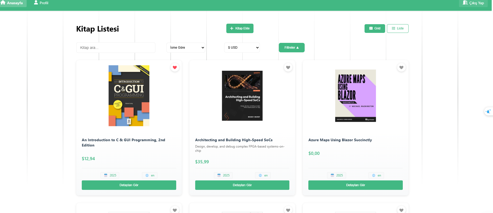
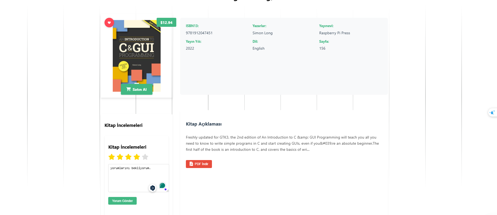
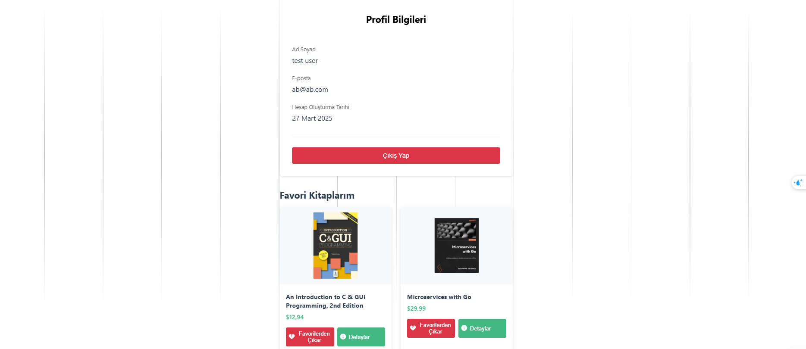

# 📚 Bookshelf - Kişisel Kitap Yönetim Uygulaması

## 🌟 Proje Tanıtımı
Bookshelf, kitapseverlerin dijital kitap koleksiyonlarını yönetmelerine olanak sağlayan modern bir web uygulamasıdır. Vue.js 3 ile geliştirilen bu uygulama, kullanıcılara zengin bir kitap yönetim deneyimi sunar.

## 💫 Temel Özellikler

### 📖 Kitap İşlemleri
- Detaylı kitap arama ve filtreleme
- ISBN13 bazlı kitap detayları
- PDF indirme imkanı (mevcut olan kitaplar için)
- Benzer kitap önerileri
- Sosyal medya paylaşım entegrasyonu

### 💰 Gelişmiş Fiyatlandırma Sistemi
- Gerçek zamanlı döviz çevirisi (USD, EUR, TRY, GBP)
- Dinamik kur güncelleme
- Farklı para birimlerinde fiyat görüntüleme
- Exchange Rate API entegrasyonu

### 👤 Kullanıcı Yönetimi
- JWT tabanlı kimlik doğrulama
- Profil özelleştirme
- Favori kitap koleksiyonu
- Şifre sıfırlama sistemi

## 📱 Ekran Görüntüleri

### Ana Sayfa

- Kitap arama ve filtreleme
- Kategori seçimi
- Döviz kuru dönüşümü
- Grid/Liste görünümü

### Kitap Detay Sayfası

- Detaylı kitap bilgileri
- PDF indirme seçeneği
- Sosyal medya paylaşımı
- Benzer kitap önerileri

### Profil Sayfası

- Kullanıcı bilgileri
- Favori kitaplar
- Eklenen kitaplar listesi

## 🛠️ Teknik Detaylar

### Kullanılan Teknolojiler
- **Frontend:** Vue.js 3, Vuex 4
- **Routing:** Vue Router 4
- **HTTP Client:** Axios
- **UI Framework:** Custom CSS
- **Icons:** Font Awesome 6
- **Storage:** Local Storage
- **API:** IT Bookstore API, Exchange Rate API

### Performans Optimizasyonları
- Lazy loading component yapısı
- Vuex modüler store mimarisi
- Responsive tasarım
- Component bazlı CSS
- Dynamic import

